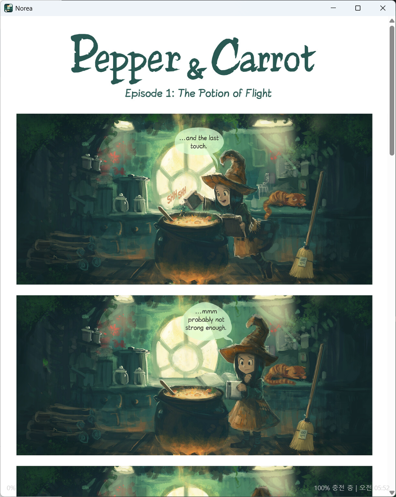
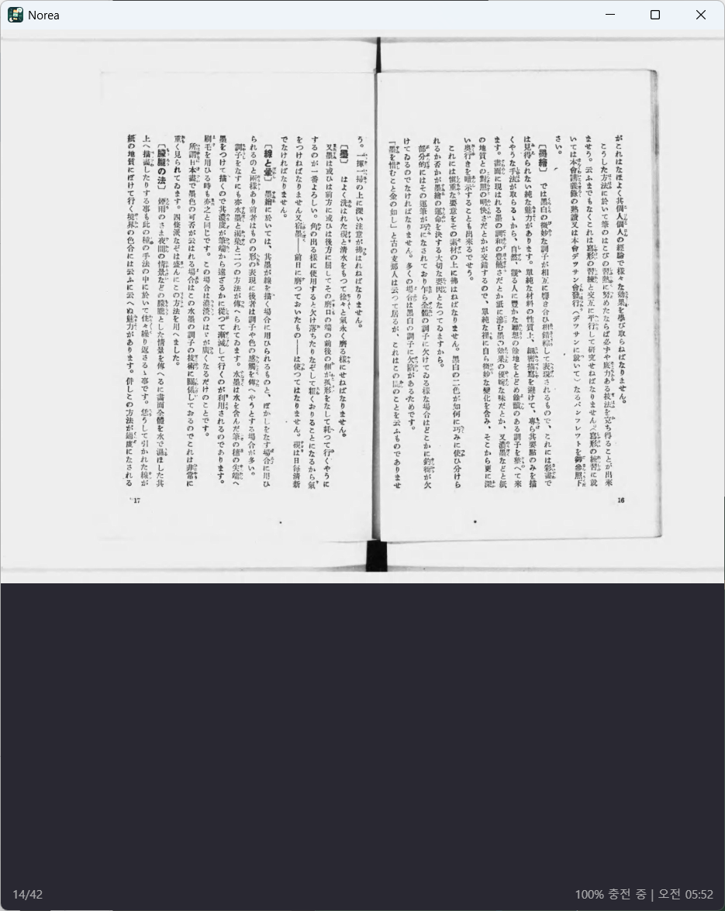

# Norea

Norea is a local-first reader for light novels, webtoons, and manga on Windows
and Android.
It keeps your reading sources, library, downloads, and progress in one app.

Norea is inspired by [lnreader/lnreader](https://github.com/lnreader/lnreader),
but it is a separate app with its own data, backup, and source system.

## Screenshots

<p align="center">
  
</p>

<p align="center">
  
  
  
</p>

### Webtoon and Manga Reading

Norea supports image-based chapters as well as text. Scroll through long-strip
webtoons or read manga and comics page by page.

<p align="center">
  
  
</p>

## What You Can Do

- Browse and search installed reading sources.
- Add novels to your library and organize them with categories.
- Import local plain text, HTML, Markdown, EPUB, and PDF files.
- Open TXT, EPUB, and PDF files with installed Windows or Android builds,
  import them into file-named local works, and continue directly in the reader.
- Cache rendered chapter media for offline reading.
- Route source-plugin requests through an app-local OpenVPN tunnel on Windows
  and Android, using an imported `.ovpn` profile or the built-in VPN Gate server
  finder.
- Create local novel homes, add chapter files later, reorder local chapters, and
  manage local metadata with locally uploaded cover images.
- Read text, webtoon, and manga chapters in paged or scrolling mode.
- Change themes, font size, text color, tap zones, and keyboard navigation.
- Track reading progress, history, unread chapters, and downloaded chapters.
- Download chapters for later reading.
- Export and import local backups for your library, progress, categories,
  source settings, and downloaded chapters.

## Current State

Norea is usable for testing, but it is not a polished app-store release yet.

Current limits:

- macOS and iOS are not planned right now.
- Linux builds are no longer produced or supported.
- Some protected sources may ask you to open the in-app site browser once before
  search or downloads work.
- Android background downloads still need more device testing.
- There is no automatic updater yet. Use Settings -> About to check and
  download newer builds manually.

## Download

For regular installs, use the
[latest GitHub release](https://github.com/tinywind/norea/releases/latest).
Release assets are the stable public downloads.

For a newer tester build from the current `main` branch, use the
[dev-0.2 GitHub prerelease](https://github.com/tinywind/norea/releases/dev-0.2).
Successful platform workflows refresh its installers, packages, APKs, update
metadata, and checksums.

Workflow artifacts remain available as a fallback while the prerelease is being
refreshed:

1. Open the latest successful workflow run for your platform:
   [Windows](https://github.com/tinywind/norea/actions/workflows/windows.yml?query=branch%3Amain+is%3Asuccess) or
   [Android](https://github.com/tinywind/norea/actions/workflows/android.yml?query=branch%3Amain+is%3Asuccess).
2. Open the run and scroll to Artifacts.
3. Download the matching artifact:

| Platform | What to download |
| --- | --- |
| Windows x64 | `norea-windows-x64-nsis` or `norea-windows-x64-msi` |
| Windows ARM64 | `norea-windows-arm64-nsis` or `norea-windows-arm64-msi` |
| Android phone or tablet | `norea-arm64.apk` |
| Android emulator or WSA | `norea-x86_64.apk` |

Workflow artifacts are kept for 30 days. If an artifact is expired, use a newer
successful run, the dev-0.2 prerelease, or the latest stable release.

## First Run

1. Install and open Norea.
2. Add a reading source list from Browse -> Sources.
3. Install one or more sources.
4. Search a source, open a novel, and add it to your library.
5. Open a chapter to read. Download chapters you want available later.

## Add Reading Sources

Reading sources are installed separately from the app. The sample source list is
maintained at [tinywind/norea-plugins](https://github.com/tinywind/norea-plugins)
and focuses on public-domain, open-license, official-API, and user-owned
self-hosted examples.

To add the sample source list:

1. Open Browse -> Sources.
2. Choose Set repository.
3. Paste this URL:

   ```text
   https://raw.githubusercontent.com/tinywind/norea-plugins/dist/v0.2/.dist/plugins.json
   ```

4. Save it.
5. Install sources from Available source plugins.

Only install and use sources you are allowed to access in your country and under
the source site's terms.

## Backup

Use Settings -> Backup to export or import your local library data. Backups
include your library, progress, categories, source settings, and downloaded
chapter content, including cached chapter media used by downloaded HTML
chapters.

## Version Compatibility

Norea keeps app data and backup compatibility inside each active release line.
Stable releases (`1.0.0` and later) guarantee compatibility only within the same
major version. During pre-release development (`0.x.y`), compatibility is
guaranteed only within the same minor version.

For example, `0.1.x` data is supported by later `0.1.x` releases, but `0.2.0`
may introduce incompatible data changes. Export a backup before moving across a
major version, or across a minor version while Norea is still `0.x`.

The 0.2 app and plugin contract do not guarantee compatibility with 0.1 app
data, downloaded content, or source plugins.

Maintainer details live in
[docs/release-compatibility.md](./docs/release-compatibility.md).

## For Developers

Developer setup, local plugin testing, release artifact details, and
contribution rules live in [docs/development.md](./docs/development.md).

## License

MIT. Upstream assets and translation seeds remain MIT-compatible and are
credited in the app where relevant.
